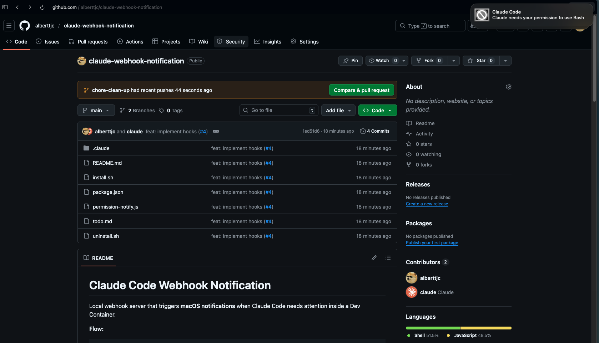

# Claude Code Webhook Notification

Local webhook server that triggers **macOS notifications** when Claude Code needs attention inside a Dev Container.



**Flow:**
```
Dev Container → host.docker.internal:7777 → macOS webhook → OS-level alert
```

## Compatibility

**macOS only.** This project does not work on Windows or Linux because:

- **`terminal-notifier`** is a macOS-only notification tool (installed via Homebrew)
- **`install.sh`** relies on macOS/Unix tooling (`lsof`, `disown`, `.zshrc`/`.bashrc`)
- While `host.docker.internal` works on Docker Desktop for both macOS and Windows (so the networking layer is portable), the notification layer is not

## Prerequisites

- macOS host
- Docker Desktop running
- Node.js installed on your Mac
- VS Code with Dev Containers

## Setup

### 1. Install terminal-notifier (macOS host)

```bash
brew install terminal-notifier
```

Verify it works:

```bash
terminal-notifier -title "Test" -message "If you see this, it works."
```

### 2. Configure macOS notification style

1. Open **System Settings > Notifications**
2. Find your terminal app (Terminal / iTerm)
3. Set **Alert Style** to **Alerts** (not Banners) — this makes notifications persist until clicked

### 3. Start the webhook server (macOS host)

#### Auto-Start (Recommended)

Run the install script once — it adds a snippet to your shell profile so the server starts automatically with every new terminal:

```bash
cd /path/to/claude-webhook-notification
./install.sh
```

That's it. The server starts immediately and will auto-start in future terminals. To remove it later:

```bash
./uninstall.sh
```

#### Manual

If you prefer to start it yourself each time:

```bash
cd /path/to/claude-webhook-notification
npm start
```

Leave this terminal running while you work.

### 4. Test from Dev Container

Inside your dev container:

```bash
# Basic test (backward compatible)
curl -X POST http://host.docker.internal:7777 \
  -H "Content-Type: application/json" \
  -d '{"message":"Test notification"}'

# Test with hook payload format
curl -X POST http://host.docker.internal:7777 \
  -H "Content-Type: application/json" \
  -d '{"notification_type":"permission_prompt","title":"Permission needed","message":"Claude needs permission to use Bash"}'
```

You should see a macOS notification appear.

### 5. Wire into Claude Code

Copy `.claude/settings.json` to your project's `.claude/settings.json`:

```json
{
  "hooks": {
    "Notification": [
      {
        "matcher": "permission_prompt|idle_prompt|elicitation_dialog",
        "hooks": [
          {
            "type": "command",
            "command": "INPUT=$(cat) && curl -s -X POST http://host.docker.internal:7777 -H 'Content-Type: application/json' -d \"$INPUT\" > /dev/null 2>&1 || true"
          }
        ]
      }
    ]
  }
}
```

The hook reads Claude Code's stdin JSON payload (which includes `notification_type`, `title`, `message`, etc.) and forwards it to the webhook server. The matcher ensures the hook only fires for permission prompts, idle prompts, and elicitation dialogs — not for every notification type.

## Notification types

| `notification_type` | Message shown |
|---|---|
| `permission_prompt` | Claude Code is waiting for permission |
| `idle_prompt` | Claude Code is idle and waiting for input |
| `elicitation_dialog` | Claude Code needs your input |
| (unknown/missing) | Falls back to `message` field or "Claude Code needs attention" |

## Configuration

| Environment Variable | Default | Description |
|---------------------|---------|-------------|
| `NOTIFY_PORT` | `7777` | Port the webhook server listens on |

## Troubleshooting

- **No notification appears:** Check that `terminal-notifier` is installed and your terminal app has notification permissions in System Settings
- **Can't reach server from container:** Ensure Docker Desktop is running — `host.docker.internal` is only available with Docker Desktop on macOS
- **Notification disappears too fast:** Set Alert Style to "Alerts" (not "Banners") in System Settings > Notifications
